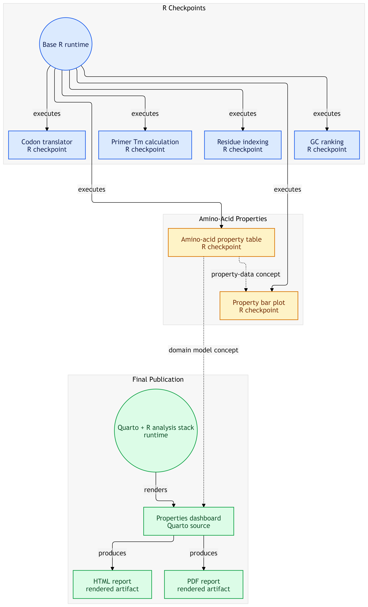

# Protein R Foundations

  

Practice repository for R fundamentals, worked through small biology-flavored
problems instead of the course's own generic examples.

  
 
  
  
  
  
  
  
  
  

## What this is

Checkpoint-by-checkpoint practice completed alongside HarvardX's *Data
Science: R Basics* (PH125.1x), paired with Rafael Irizarry's freely available
*Introduction to Data Science* as the reference text the course is built
from. Each checkpoint takes that section's R concept and applies it to a
small, real biological problem rather than the book's own worked example.

## What this isn't

Not a research project, and not written to look like one. There's no
research question here — this is scoped, deliberate practice for building R
fluency before it's needed for real proteomics and genomics work later in
the roadmap. For the actual research portfolio:

- [`egfr-integrative-proteogenomics`](#) — the flagship project this
  foundation feeds into
- [`protein-python-foundations`](https://github.com/Afraim10/protein-python-foundations) — the Python equivalent of this repo,
  from the same stage of the same plan

## Structure

  

| Checkpoint | Concept | Problem |
|---|---|---|
| 01 | Objects, functions, scripts | Primer melting temperature (Wallace rule) |
| 02 | Data types, data frames | Amino acid property table (Kyte-Doolittle hydrophobicity) |
| 03 | Vectors, sorting, vector arithmetic | GC content ranking across multiple sequences |
| 04 | Indexing, logicals, `%in%` | Residue position lookup in a toy protein sequence |
| 05 | Base R plotting | Bar plot of an amino acid property |
| 06 | Programming basics — conditionals, functions, loops, vectorization | Codon-to-amino-acid translator |
| final | ggplot2 + Quarto (short detour beyond the course itself) | [Amino Acid Physicochemical Properties](https://afraim10.github.io/protein-r-foundations/final/amino_acid_properties.html) — Project 0-B in the master plan |

### **Preview:**

Full analysis: [live page](https://afraim10.github.io/protein-r-foundations/final/amino_acid_properties.html) · [PDF](final/amino_acid_properties.pdf) · [source](final/amino_acid_properties.qmd)

## Environment

Base R only through Checkpoint 06 — no external packages, matching what the
course itself covers. The final project is a Quarto document (`.qmd`) using
`ggplot2`, `Peptides`, `ggrepel`, `dplyr`, `tibble`, `readr`, and
`gridExtra`; each package's role is inspected and justified inline in the
document itself rather than assumed. R version is noted at the top of each
script rather than pinned in a separate environment file; a repo this size
doesn't need the reproducibility infrastructure the EGFR repo does.

## How this was done

Each checkpoint is attempted independently against the course material
first. Some were reviewed afterward, mistakes were identified, and corrected
versions replaced the originals — noted in the relevant commit message
rather than left implicit. No checkpoint was solved by asking for a finished
script upfront.

## Status

Complete. All checkpoints and the final project were finished section by
section as the course progressed.

- [x] Checkpoint 01 — Primer melting temperature (Wallace rule)
- [x] Checkpoint 02 — Amino acid property table (Kyte-Doolittle hydrophobicity)
- [x] Checkpoint 03 — GC content ranking across multiple sequences
- [x] Checkpoint 04 — Residue position lookup in a toy protein sequence 
- [x] Checkpoint 05 — Bar plot of an amino acid property 
- [x] Checkpoint 06 — Codon-to-amino-acid translator
- [x] Final Project — Amino Acid Properties Dashboard

